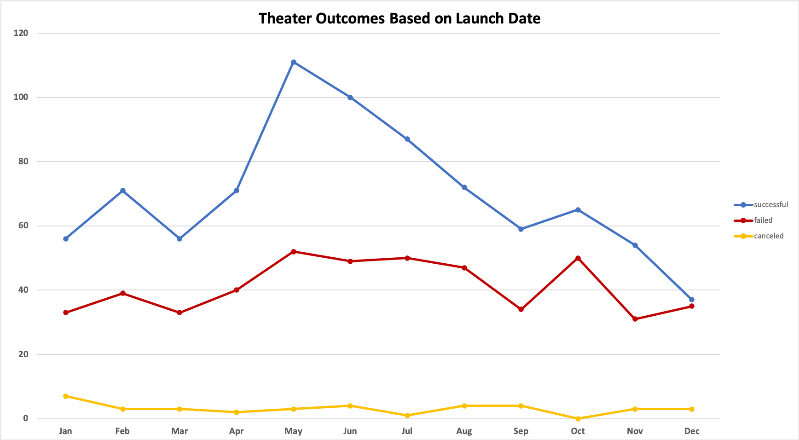
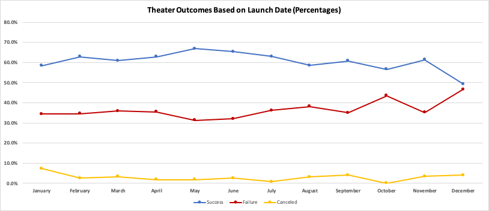
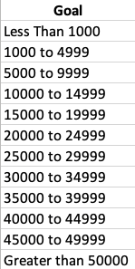
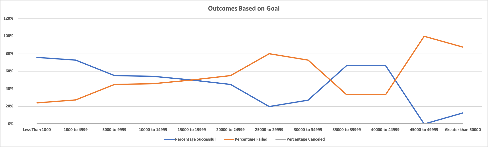

# Kickstarting with Excel

## Overview of Project

An analysis of Kickstarter campaign data.

### Purpose

This project aims to analyze how Kickstarter campaigns comparable to Louise's play, Fever, fared in relation to their launch dates and funding goals. With this information, Louise will be able to determine the best approach to crowdfunding her play.

## Methodology, Analysis and Challenges

I started the process by pulling data on more than 4,000 Kickstarter campaigns launched from 2009 to 2017. From there, I parsed the data to focus on how theater projects fared based on launch date and outcomes for plays based on funding goals, as those descriptions aligned with Louise’s Fever project. 

Overall, theater campaigns launched in summer months and plays with goals of less than $15,000 showed higher rates of success. The main difficulty I encountered while conducting this analysis was whether it would be best to make recommendations based on outcome count or percentage rate. In the end, I chose percentage rate of outcomes as a primary determinate of a trend, as percentage looks at each outcome relative to the total number of campaigns in the relevant category. 

### Analysis of Outcomes Based on Launch Date

Starting with theater outcomes based on launch date, I created a pivot table that would allow me to analyze the amount of successful, failed or canceled theater projects and the months in which those results occurred over the period from 2009 through 2017. When building the pivot table, I chose filters that would allow me to narrow results based on parent category or year. I also organized the pivot table to display the counts of each outcome divided by month. I supplemented the table with a line graph to offer a visual that could quickly show which outcomes were strongest in each month. 

#### Outcomes According to Count

With 111 successful projects, May led the pack, followed by June (100) and July (87). Months that saw the most failed attempts were May (52), July (50) and October (50). Cancellations were relatively low throughout the year. January lead with seven cancellations, followed by June, August and September, which all reported four cancellations. 

There was a potential cause for concern here. May and July, which scored in the top three for successful outcomes, also scored in the top three for failed outcomes, which could seem conflicting on the surface. I wanted to explore this further. 

There were more projects launched in the summer. So naturally, there would be a higher count of outcomes, generally, though not necessarily evenly distributed. 

The months with the most newly-launched projects were May (166), June (153) and July (138). 

As such, solely looking at the count of each outcome was not sufficient, and I believed it was worth considering success, failure and cancellation rates as percentages for good measure. 

#### Outcomes According to Percentage

May remained at the top with a success rate of 67%, followed by June (65%), while July tied with April and February for third (63%). The original top three maintained their positions, but July’s third place was joined by April and February. 

However, rates of failure showed a different story. December had the highest failure rate at 47%, followed by October (43%) and August (38%). October was the only month to hold its position in the failed category. 

### Analysis of Outcomes Based on Goals

When analyzing outcomes based on goals, I narrowed the data to the plays subcategory and divided the goals into roughly $5000 intervals after $1,000 and before $50,000.

I then created columns to display the counts and percentages of successful, failed and canceled campaigns to see how each of the goals fared. 

Plays with goals from less than $1,000 to about $15,000 had a higher rate of success, ranging from 54% to 76% in success rates. The rate of failure spiked significantly when goals surpassed $40,000, with a failure rate of 88% to 100%. Interestingly, 0% of plays were marked as canceled. 

### Challenges and Difficulties Encountered

## Results

Based on the data, theater projects were most successful in May, followed by June and then July (along with February and April when considering success rates). The number of new projects as well as the success rate started to decline further into the year when compared to the May peak. 

Additionally, there were typically less projects launched around the U.S. holiday season, which covers November through January. 

When looking at outcomes based on goals for plays, I can assess that Louise could increase her chances of success by ensuring her funding goal does not exceed $15,000. 

### Limitations

There were a number of limitations that left unknowns on which factors drove the data. 

For example, we did not have information on how each campaign was marketed, which likely played a role in attracting donors. Additionally, the information we pulled is from a single crowdfunding site – Kickstarter. Data from other crowdfunding platforms such as Indiegogo, GoFundMe, CircleUp and others could offer a larger data set to determine if the trends are similar across the board or if there may be something unique about Kickstarter.

We should also explore what exactly it means for a project to be “canceled.” Did the project get funding elsewhere and so the applicants canceled the Kickstarter campaign? If so, could that count as a success? Or did the applicants simply give up on the project? If so, could that count as a failure? 

### Other Helpful Tables and Graphs

In addition to our existing charts, it could also be beneficial to look at which successful projects outperformed their goals and by how much as well as the percentage at which failed projects underperformed.  

